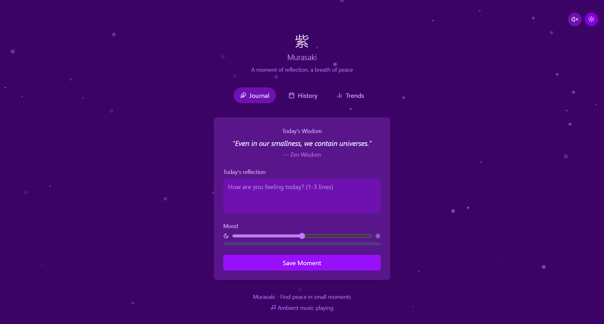

# Murasaki - A Microjournaling and Mood Tracking App 🌿💜.

## Overview

**Murasaki** is a serene microjournaling web application, inspired by Japanese mindfulness philosophies and featuring a soothing purple aesthetic. It enables users to record brief daily reflections, track their mood over time, and view their emotional patterns with calming visuals.

---

## Key Features

- **Microjournaling Interface:** Minimalist text area for daily reflections (1-3 lines).
- **Mood Tracking:** Simple 1-5 scale, with moods represented through soft purple tones.
- **Purple Japanese Aesthetic:** Wabi-sabi and mono no aware influences in design.
- **Particle Background:** Canvas-based floating purple particles for a tranquil feel.
- **Three Main Sections:**
  - **Journal:** Write daily reflections with inspiring quotes.
  - **History:** Timeline of past entries with color-coded moods.
  - **Trends:** Graph visualization of mood patterns over time.
- **Responsive Design:** Mobile-friendly layout and dynamic scaling.
- **Day/Night Theme Toggle:**
  - Sun/Moon button to switch themes.
  - Themes stored in localStorage.
  - Particle colors adapt based on theme.
- **Background Music:**
  - Play/Pause ambient background music.
  - Volume control and visual indicator.
  - Audio persists across tabs.
- **Accessibility:**
  - ARIA labels for controls.
  - Keyboard navigable.

---

## Tech Stack

- **Frontend:** React.js (functional components and hooks)
- **Styling:** Tailwind CSS
- **Icons:** lucide-react
- **Animation:** Canvas API for particle background
- **State Persistence:** LocalStorage

---

## Screenshots

> 


---

## Installation and Running Locally

Follow these steps to set up **Murasaki** on your local machine:

1. **Clone the repository:**

```bash
git clone https://github.com/your-username/Murasaki.git
cd Murasaki
```

2. **Install dependencies:**

```bash
npm install
```

3. **Start the development server:**

```bash
npm run dev
```

4. **Visit in your browser:**

Open [http://localhost:5173](http://localhost:5173) to view the app.
Deployed link: [Murasaki](https://murasaki-nu.vercel.app/)

---

## Folder Structure

```bash
murasaki/
├── public/
│   └── music/    # Ambient music file(s)
├── src/
│   ├── assets/   # Images, icons, particle files
│   ├── components/
│   │   └── MurasakiApp.jsx
│   ├── context/  # Theme and Music context providers
│   ├── utils/    # Helper functions and localStorage handlers
│   ├── App.jsx
│   └── main.jsx
├── tailwind.config.js
├── package.json
└── README.md
```

---

## Future Enhancements

- Replace placeholder music with curated ambient tracks
- Add entry editing and deletion functionality
- Cloud sync for journal entries
- More detailed mood analytics

---

## Credits

- Japanese philosophy quotes: Various sources on mindfulness
- Particle background inspiration: Custom canvas particle systems
- Ambient music: To be credited upon production release

---

## License

This project is licensed under the **MIT License**. Feel free to use, modify, and distribute.

---

## Acknowledgements

> "Murasaki" means "purple" in Japanese — symbolizing calm, creativity, and serenity.

Thank you for experiencing Murasaki. ✨
